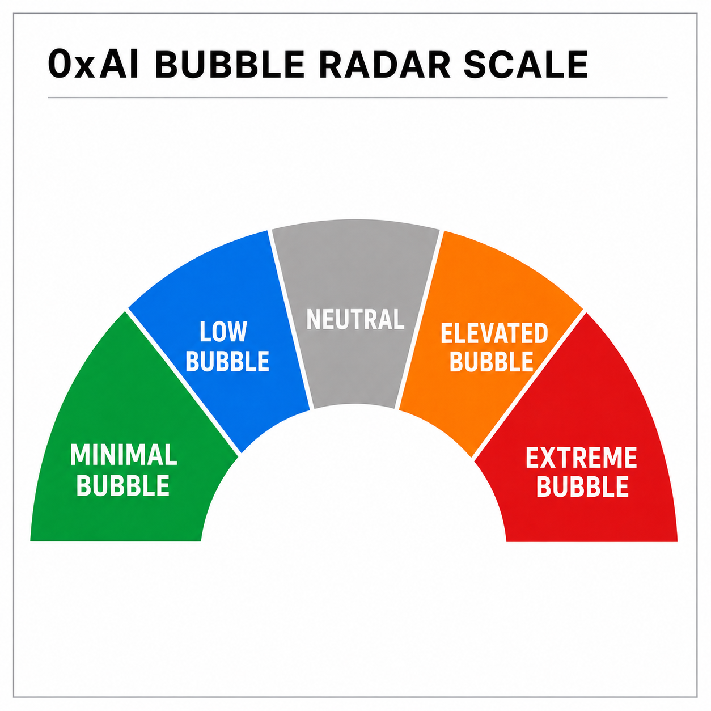
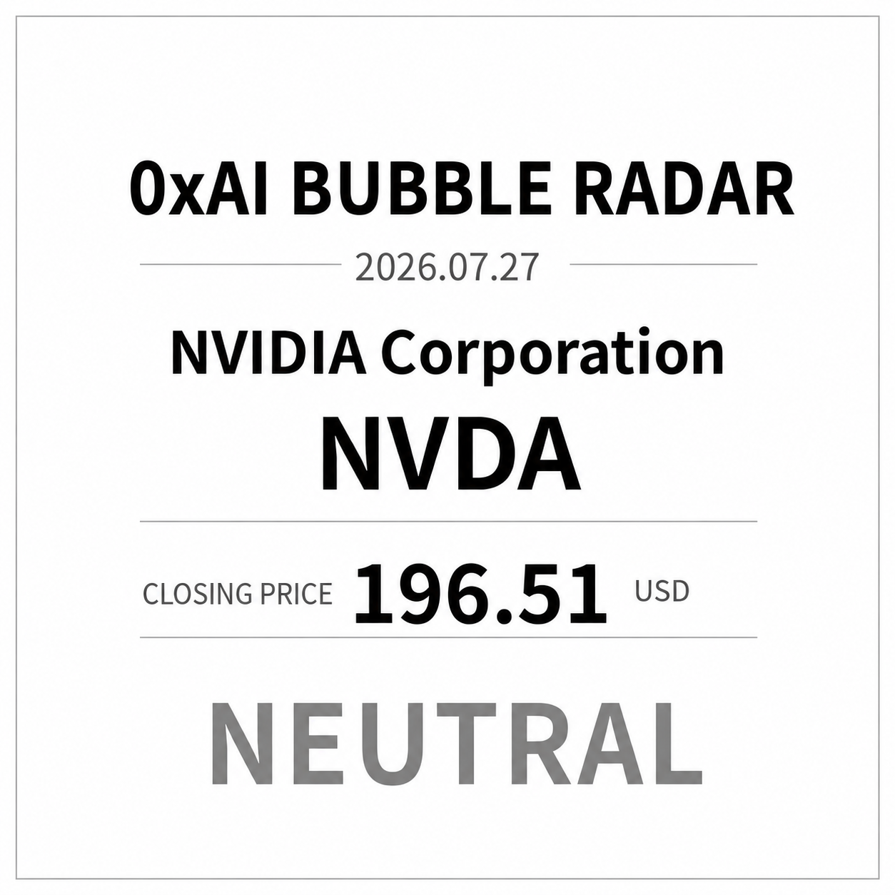

# 0xAI Bubble Radar

## About 0xAI Bubble Radar

**0xAI Bubble Radar** is a market-state detection tool designed for widely followed U.S. stocks. It uses algorithmic analysis of price action, trends, and market structure to continuously track changes in bubble conditions and presents the results through clear, easy-to-read daily cards.

Each day, we select one actively watched U.S. stock and record its trading date, closing price, and bubble status. The bubble status is not a buy or sell recommendation. It is intended to help users observe changes in market heat and speculative intensity over time.

## Bubble Condition Levels

Bubble conditions are classified into five levels:

* **MINIMAL**
* **LOW**
* **NEUTRAL**
* **ELEVATED**
* **EXTREME**

## Date Convention and Disclaimer

**Date convention:** All data corresponds to the actual U.S. market trading day. Because the cards are published from an Asian time zone, the date shown on each card reflects the relevant U.S. trading date, which is typically one calendar day before the publication date.

*For informational and research purposes only. Not financial or investment advice.*

## Latest Card

### 2026-07-27 — NVDA — NEUTRAL

## Historical Card Archive

| U.S. trading date | Ticker | Closing price | Bubble status | Card |
| --- | --- | ---: | --- | --- |
| 2026-07-27 | NVDA | $196.51 | NEUTRAL | [View card](daily/2026-07-27_NVDA_NEUTRAL.png) |
